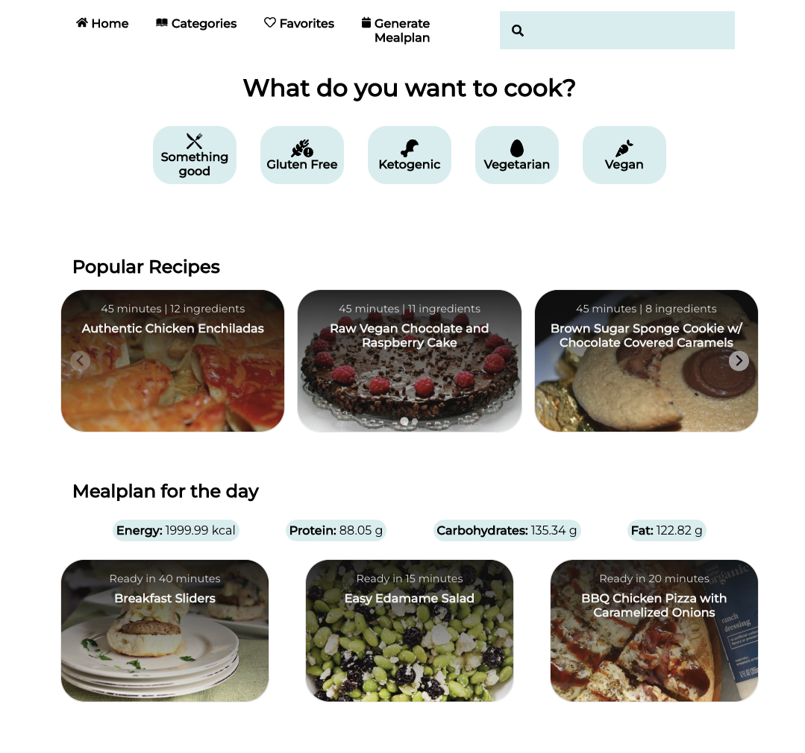

# RecipeApp

## Welcome! 👋

This is my recipe app built using React and [ Spoonocular API](https://spoonacular.com/food-api)

## Features

App is fully responsive.
It fetches recipes from Spoonocular API and displays them in different categories. You can search for recipe and there is also one-day mealplan generator with controls (calories, diet type).

## Tools used

- React
  - SCSS Modules
  - React Router
  - SplideJS
- SASS
- Spoonocular API

## Live website

- [Netlify](https://benevolent-muffin-09c9df.netlify.app/)
